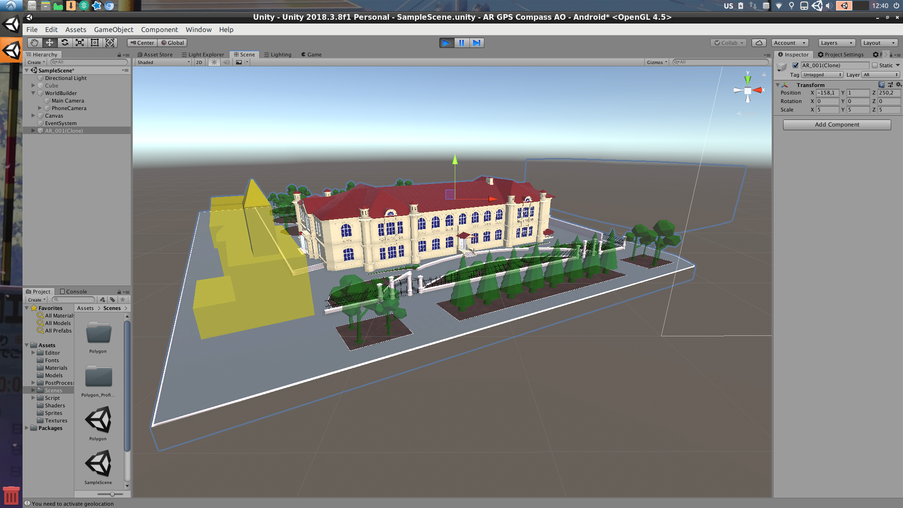
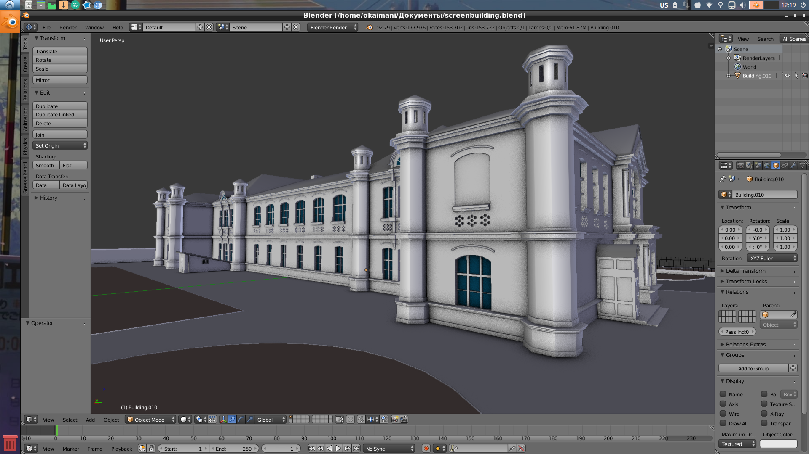
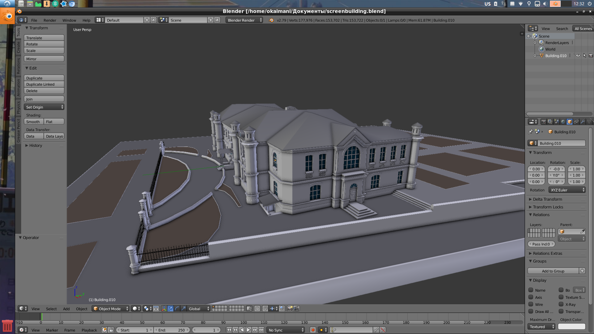
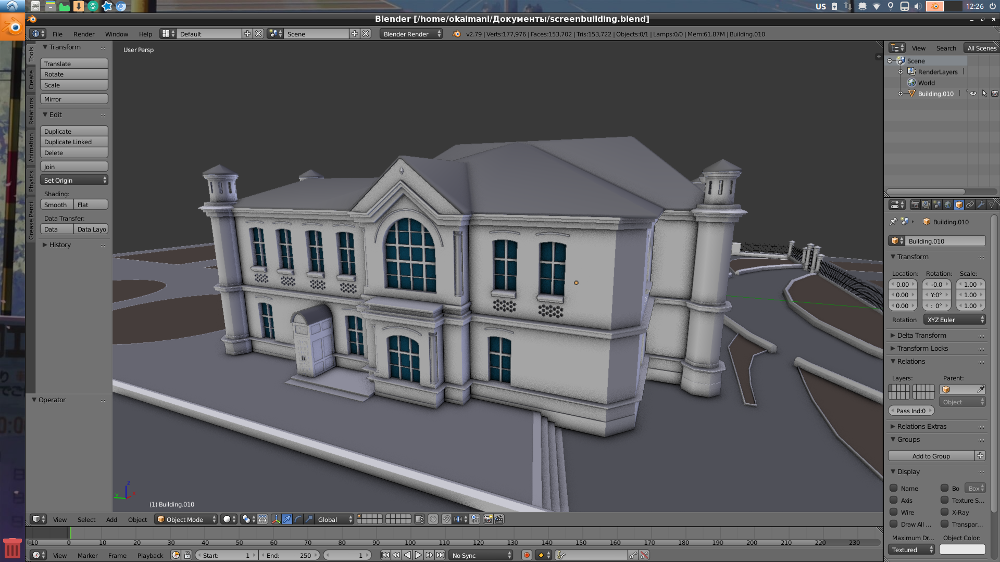
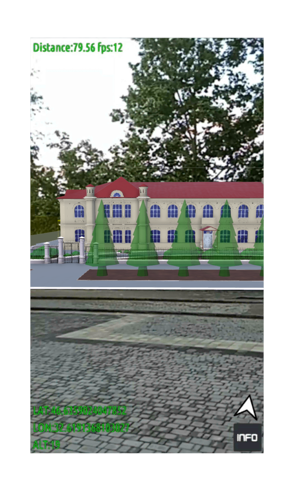
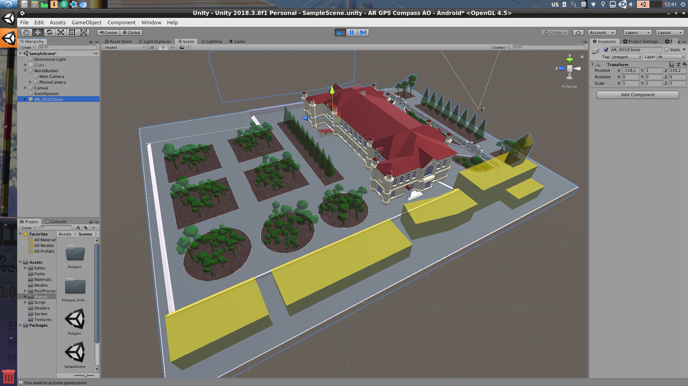
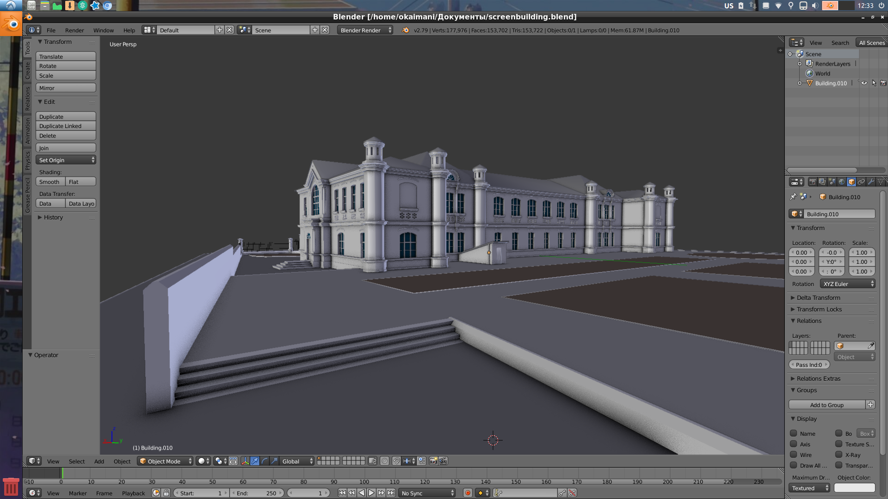
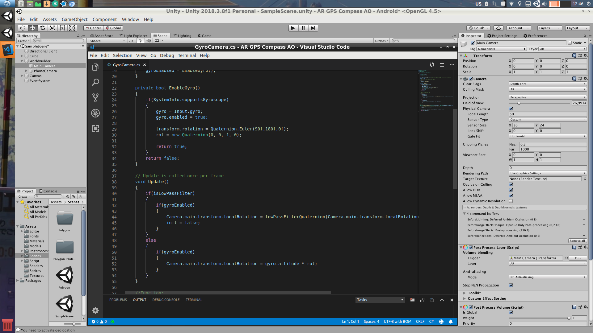
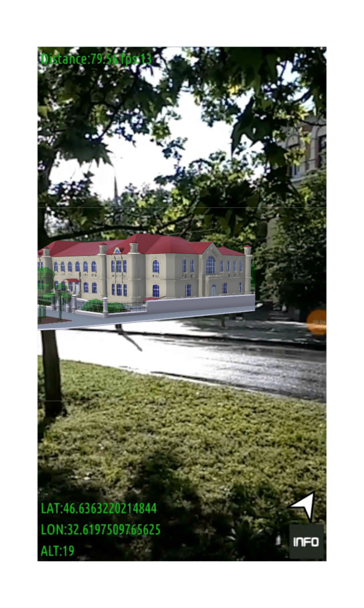
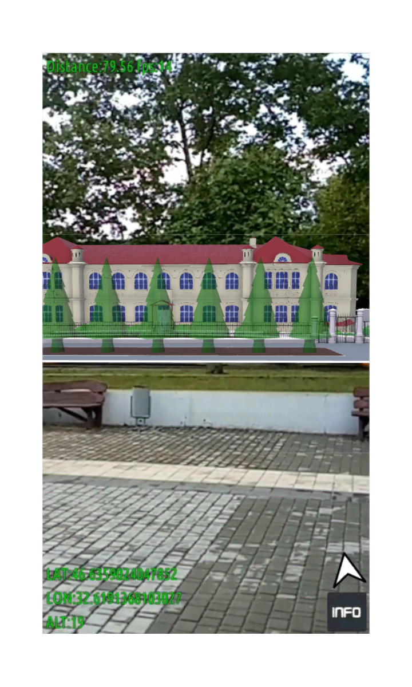

# AR‑GPS‑Compass‑AO (Unity / Android)

A location‑aware AR prototype that places a 3D campus model at real‑world coordinates using the phone’s **GPS** and **compass/gyro**. The scene renders in Unity and aligns to the user’s heading; on screen you can see **distance/FPS/LAT/LON/ALT** overlays for verification.

> Built with **Unity 2018.3.8f1** (Android, OpenGL). No cloud services, no markers — everything is driven by on‑device sensors.

---

## Highlights
- **GPS‑anchored AR**: converts `(lat, lon, alt)` into a stable local coordinate frame and offsets the world relative to the device to minimize jitter at large distances.
- **Heading alignment**: uses **compass + gyroscope** to orient the camera toward north and keep the world rotation consistent while moving.
- **Sensor smoothing**: simple time‑window averaging for location and optional low‑pass on rotation to suppress micro‑jitter from sensors.
- **Deterministic update loop**: position/orientation updates run on a fixed interval (≈1 s for GPS, faster for gyro) instead of per‑frame to reduce noise and battery drain.
- **Self‑contained**: 3D assets modeled in Blender and integrated into the Unity scene; no runtime downloads.
- **Field verification**: in‑app overlays show **distance/FPS/LAT/LON/ALT**, making it easy to validate placement in real environments.

---

## Visuals



*In‑engine view (Unity **2018.3.8f1**) — the scene runs on Android with ambient occlusion and lightweight post‑processing.*









<details>
<summary>More views</summary>











</details>

---

## Tech Stack
- **Engine:** Unity 2018.3.8f1 (Android target)
- **Rendering:** Forward pipeline, simple post‑processing/AO
- **Sensors:** `Input.location` (GPS), `Input.compass` + `Input.gyro`
- **3D Assets:** Modeled in Blender 2.79; imported as static meshes with basic materials

> The project does not rely on cloud anchors or image markers. Placement is purely geo/heading based.

---

## How It Works (Concept)

### 1) From Earth coords to a local scene
Real‑world points are defined by latitude/longitude/altitude. For AR we avoid placing them far from Unity’s origin to reduce floating‑point error and jitter. The app:

1. Chooses the **device position** as the local origin at runtime.
2. Projects `(lat, lon)` to a **tangent plane** (local ENU‑like coordinates) near the user.
3. Computes `Δx, Δz` from the device to each POI using an equirectangular approximation (accurate enough for short distances):

```csharp
// pseudo‑code
const float EarthR = 6378137f; // meters
float dLat = Mathf.Deg2Rad * (poiLat - userLat);
float dLon = Mathf.Deg2Rad * (poiLon - userLon);
float meanLat = Mathf.Deg2Rad * ((poiLat + userLat) * 0.5f);
float dx = EarthR * dLon * Mathf.Cos(meanLat);
float dz = EarthR * dLat;               // north/south
float dy = poiAlt - userAlt;            // optional altitude
Vector3 local = new Vector3(dx, dy, dz);
```

4. Offsets the **entire world** or the **POI** by this local vector so the 3D content appears at the correct bearing and distance.

### 2) Heading & camera orientation
- Reads **magneticHeading** from `Input.compass`, fuses it with **gyroscope attitude** for short‑term stability.
- Applies an optional **low‑pass** filter to attenuate sudden micro‑shifts.
- Rotates the AR camera (or world) so that **+Z** aligns with geographic north (magnetic by default).

```csharp
// guard‑based, flat style
Quaternion rotRef = Quaternion.Euler(90f, 180f, 0f); // device alignment
if (SystemInfo.supportsGyroscope)
{
    Input.gyro.enabled = true;
}

void Update()
{
    if (SystemInfo.supportsGyroscope)
    {
        // fast orientation from gyro
        transform.localRotation = Input.gyro.attitude * rotRef;
    }

    // magnetic heading as absolute long‑term reference
    float heading = Input.compass.magneticHeading; // degrees
    // example: blend gyro yaw toward compass yaw (not shown: wrap & slerp)
}
```

### 3) Rate‑limited updates
- **Location** updates are processed on a timer (e.g., every 1 s) rather than every frame.
- **Rotation** (gyro) can update each frame; heading corrections are blended more slowly.

This reduces noise and preserves battery while keeping the pose stable.

---

## Project Structure (indicative)
```
Assets/
  Scenes/
    SampleScene.unity        # main scene with AR camera and overlays
  Script/
    DeviceGPS.cs             # permission checks, GPS start/stop, averaging
    CreateAR.cs              # initial placement / spawning
    ARControl.cs             # periodic re‑positioning / heading align
  Models/                    # Blender‑modeled meshes (campus/building/trees)
  Materials/
  PostProcess/
DemoImg/                     # screenshots used in this README
```

> Script names may differ slightly in your fork; this block reflects responsibilities used in the project.

---

## Setup & Build (Android)
1. **Clone** the repository and open in **Unity 2018.3.8f1** (or a close 2018.3 LTS; newer versions may require package updates).
2. **Switch Platform:** `File → Build Settings… → Android → Switch Platform`.
3. **Player Settings (Android):**
   - Minimum API Level: Android 7.0+ (recommended)
   - Target API Level: latest installed
   - Orientation: Portrait (or as you prefer)
   - Graphics: OpenGL ES 3.0/3.1 (or Vulkan if your device supports it)
4. **Permissions:** ensure the app requests **Camera** and **Location**. Unity will auto‑request runtime permissions; verify with a first‑run prompt.
5. **Build & Run** on a device with GPS, compass, and gyro.

> Accuracy improves outdoors with a clear sky view. Calibrate the compass if the OS requests it.

---

## Configuration & Tuning
- **Update interval (location):** default ≈ 1 s. Increase for lower battery usage; decrease for faster response.
- **Averaging window (location):** average the last `N` GPS samples to reduce flicker in urban canyons.
- **Low‑pass (heading):** blend camera yaw toward compass yaw with a small factor (e.g., 0.05–0.15 per second) to correct long‑term drift without visible snaps.
- **Placement scale:** the example scene uses meters; adjust the model scale for correct perceived size at given distances.
- **Altitude use:** if `alt` is noisy on your device, clamp or ignore `dy` and keep content on ground plane.

---

## Verification in the Field
- The on‑screen overlay shows **Distance**, **FPS**, **LAT**, **LON**, **ALT** (see `DemoImg/11‑13.png`).
- Cross‑check `LAT/LON` with any maps app; verify the **distance** roughly matches steps taken.
- Rotate slowly in place — the building should remain at a fixed bearing; recalibrate if heading drifts.

---

## Performance Notes
- Keep meshes moderately low‑poly; the provided campus block renders smoothly on mid‑range Android.
- Use static batching where possible; limit transparent materials.
- Rate‑limit expensive work (GPS processing, re‑projection) to fixed intervals.

---

## Privacy
- The app reads **location** and **sensor** data on device only. No network requests are performed.
- Do not publish builds that log precise coordinates unless you have consent for the demo location.

---

## Troubleshooting
- **Compass jumps / wrong north**: move away from metal objects; recalibrate when prompted. If your device provides true‑north, prefer it over magnetic; otherwise apply a declination offset for your region.
- **GPS accuracy poor**: wait for a fix outdoors; average multiple samples; increase the minimum accuracy threshold before updating content.
- **Content floats / slides**: ensure you recompute local projection when `LAT/LON` changes and you aren’t mixing world‑ vs local‑space transforms.
- **Very large distances**: never place content thousands of meters from `(0,0,0)`; always compute local deltas from the current device position.

---

## Roadmap (nice‑to‑have)
- True‑north correction via magnetic declination model
- Kalman/Complementary filter for yaw fusion (gyro ↔ compass)
- Simple POI database / ScriptableObjects with names and icons
- Toggleable overlays and a cleaner in‑app HUD

---

## License
MIT (or any permissive license you prefer). Add a `LICENSE` file if you plan to distribute builds.

---

## Acknowledgments
- Unity Technologies (engine, input APIs)
- Blender Foundation (3D creation suite)
- Android sensor stack (GPS/compass/gyro)
